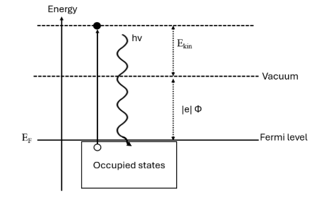
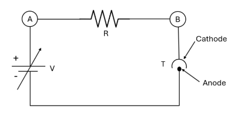

# Planck’s Constant

### Team

| Name| Roll no. |
|---|---|
|Jaidev Sanjay Khalale | (22110102) |
|Pranav Joshi | (22110197) |
|Pratyaksh Bhaye | (22110205) |
|Md Sibtain Raza | (22110148) |

## Objective

1. Determine Planck’s constant $h$ by photo-cell .
2. Demonstrate the inverse square law of radiation.

## Apparatus

- Vacuum photo-tube
- Halogen tungsten lamp
  - Light Intensity adjusting knob
- Colour filters
  - Blue : 480 nm
  - Green : 520 nm
  - Yellow : 565 nm
  - Red : 670 nm
- Regulated power supply
- Current meter
  - Display meter
  - Display meter
- Optical bench
  - Cover chamber to contain photo-diode
  - Drawtube
  - 

## Theory

Late in the 19th century, the work of experimental physicists, like Einstein, Max Planck, among many others led to the discovery and study of the photoelectric effect.
Photoelectric effect is emmission of electrons from metal surface upon incidence of high frequency light. 

Some important characteristics of this phenomenon are :

- The energy distribution is independent of the intensity of light, and depends only on frequency $v$ .
- The maximum kinetic energy of photon is
    
    $$
    K_{max} = \begin{cases}h\nu - h\nu_o & \nu > \nu_o \\ 0 \end{cases}
    $$
    
    for some threshold frequency $\nu_o = e\Phi/h$ specific to the metal. (Here $\Phi$ is the excitation potential)
    
- For a metal with excitation potential $\Phi$ , the equation translates to :
    
    $$
    h\nu = K_{max} + e\Phi \;\forall \nu \ge \nu_o
    $$
    
    The excitation of the electron from its energy band is depicted like this : 
    
    
    
    Figure 1 : Photoelectric effect
    
- There is no lag between photon hitting the metal and electron being excited (in limit of experimental accuracy). This cannot be described using wave model for light.
- The photo-current follows the inverse square law, namely $I \propto r^{-2}$ where $r$ is the distance of the light source from the metal.
The reasoning for this is that the current $I$ is proportional to the ir-radiance $E$ on the metal surface.
If $L$ is the intensity of a lamp, then $E = L/r^2$ . Thus,
    
    $$
    I \propto E \propto r^{-2}
    $$
    

We are only interested in finding the Planck’s constant through this experiment.

To do that, we use this method : 

- The maximum kinetic energy $K_{max}$ is figured out by increasing the retarding potential till the stopping potential $V_z$ , at which,
    
    $$
    eV_z =K_{max}
    $$
    
    Thus, 
    
    $$
    h\nu = eV_z + e\Phi \\\implies \boxed{V_z = \frac{h}{e}\nu - \Phi}
    $$
    
- So, when $V_z$ is plotted against $\nu$ , and a straight line if fitted to the data, the slope gives us the value of $h/e$ , and thus $h$ , since we know $e$ .

We also wish to verify the inverse square law of radiation, namely $E \propto r^{-2}$ . This is the same as verifying whether $I \propto r^{-2}$ . 
To do that, we collect data-points $(I,r^{-2})$ at various values of $r$ and fit a straight line through the data points using the least squares method.

## Experimental Setup

- The light of the halogen tungsten lamp (12 V / 35 W) falls on the cathode of vacuum photo-diode.
- The photo-diode is mounted inside a closed chamber.
- The draw-tube attached to the front of the chamber has colour filters at one end, and a lens at the other end to focus light on the cathode.
- Any colour filter’s main frequency is mentioned on it.
- The retarding voltage V between the cathode and anode can be varied using a $\pm 15 V$ multi-turn pot.
- The polarity can be switched using a button.
- Current is read using a digital nano-ammeter.
- Both the lamp and the vacuum tube are mounted on an optical bench.
- The distance between source and tube can be changed.

## Procedure

### Part 1 : Finding $h$

1. Insert the $\lambda =670 \text{ nm}$ red filter. 
2. Set light Intensity to maximum.
3. Set distance between source and tube to $r = 25\text{ cm}$
4. Set “voltage direction” switch to “-V” using the switch.
5. Set “display mode” switch to “current display”
6. Increase the retarding voltage till the current stops, i.e. till $V_z$ .
7. Switch “display mode” to “Voltage”
8. Note down the value of the voltage at the stopping potential $V_z$ .
9. Repeat steps 2 to 8 for all other filters
10. Set all knobs to minimum and switch off the set-up.
11. **Calculations**
    - Calculate frequency $\nu = c /\lambda$ for each wavelength $\lambda$ using the speed of light $c$ .
    - Plot graph of $V_z$ vs $\nu$ .
    - Use least squares to fit a line through the data.
        - The slope of the line is $m = h/e$
        - Calculate $h = m*e$
        - The y-intercept is $\Phi$

### Part 2 : Verifying $E \propto r^{-2}$

1. Turn on the set up
2. Insert the red filter ($\lambda = 670 \text{ nm}$)
3. Set voltage direction to “+V”
4. Set voltage to 0.1 V
5. Set distance between source and tube to $r = 40\ \text{cm}$
6. Set the intensity of lamp to maximum.
7. Move the source towards the tube at intervals of $\Delta r = 2\ \text{cm}$ until $r = 20 \text{ cm}$ . Take readings of current every time.
8. **Calculations**
    - Plot the graph of photo-current $I$ vs $1/r^2$
    - Use least squares to fit a line through the data points.

## Results

### Part 1 : Finding $h$ .

The data that was produced after following the procedure is

| Wavelength (nm) | Stopping potential (V) | Frequency (THz) |
| --- | --- | --- |
| 480 |  | 624.568 |
| 520 |  | 576.524 |
| 565 |  | 530.606 |
| 670 |  | 447.451 |

The same, when plotted, looks like this :

(Graph)

Using the least squares method, we found the optimum line to be

$$
V_z = \braket{\text{value}}\nu + \braket{\text{value}}
$$

The mean squared errors (MSE) was, in its optimum value, $\braket{\text{value}} \text{V}^2$

Thus, we can say that

$$
h/e \approx \braket{\text{value}} \\
\Phi \approx \braket{\text{value}}
$$

This gives us

$$
\boxed{h \approx \braket{\text{value}}}
$$

### Part 2 : Verifying $E \propto 1/r^2$

The data that was produced after following the procedure is

| distance r (m) | photo-current I (A) | r ^ (-2) |
| --- | --- | --- |
|  |  |  |
|  |  |  |

The same, when plotted, looks like this :

(Graph)

Using the least squares method, we found the optimum line to be

$$
V_z = \braket{\text{value}}r^{-2} + \braket{\text{value}}
$$

The mean squared errors (MSE) was, in its optimum value $\braket{\text{value}} \text{V}^2$